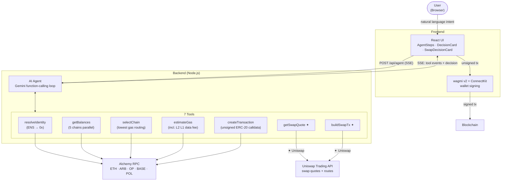

# PayAgent — Web3 AI Payment Agent

> Pay anyone across chains. Just chat. AI handles the rest.

PayAgent is an intent-based AI agent for multi-chain Web3 payments. Describe what you want in plain English — the agent resolves ENS names, scans balances across 5 chains, picks the cheapest route, and auto-swaps via Uniswap if needed. You only sign in your wallet.

Built for **ETHGlobal OpenAgents Hackathon**.

---

## Demo

| Direct Transfer | ETH → USDT Swap |
|---|---|
| Type `send 50 USDT to alice.eth` | Type `send 50 USDT to alice.eth` (no USDT in wallet) |
| AI resolves ENS, picks cheapest chain, builds tx | AI detects no USDT, fetches Uniswap quote, builds swap + transfer |
| 1 wallet confirmation | 2 wallet confirmations |

---

## Features

- **Natural language intent** — No chain selection, no address lookup, no gas math
- **ENS resolution** — Send to `alice.eth` directly, no `0x` address needed
- **Multi-chain parallel scanning** — Balances queried across 5 chains simultaneously; routes to lowest gas
- **Auto-swap via Uniswap** — No USDT? Agent swaps your ETH automatically (EXACT_OUTPUT mode)
- **4 payment paths** — Direct USDT, Direct ETH, ETH→USDT swap, USDT→ETH swap
- **Live AI reasoning** — Each agent step streams to the UI in real time via SSE
- **Human-in-the-loop** — Backend builds unsigned calldata only; your wallet signs every transaction

## Supported Chains

Ethereum · Arbitrum · Optimism · Base · Polygon

---

## Architecture

---

## Tech Stack

| Layer | Technology |
|---|---|
| Frontend | React 18 + Vite + TypeScript |
| Wallet | wagmi v2 + ConnectKit |
| AI Agent | Gemini 2.5 Flash (function calling) |
| Multi-chain RPC | viem + Alchemy |
| Swap | Uniswap Trading API |
| Identity | ENS (via Alchemy) |
| Backend | Node.js + Express + TypeScript |
| Streaming | Server-Sent Events (SSE) |

---

## Getting Started

### Prerequisites

- Node.js 18+
- A wallet browser extension (MetaMask or similar)

---

## How It Works

1. **State your intent** — Type `send 50 USDT to vitalik.eth` in the chat
2. **Agent reasons** — AI resolves ENS, scans all chains in parallel, picks cheapest route, quotes swap if needed
3. **You confirm** — Review the decision card, then sign in your wallet

The agent core is a function-calling loop where the AI model decides at runtime which tools to invoke and in what order — the tool sequence is never fixed. It adapts to what the intent actually requires:

| Intent | Tool path |
|---|---|
| `send 50 USDT to alice.eth` (has USDT) | `resolveIdentity → getBalances → selectChain → estimateGas → createTransaction` |
| `send 50 USDT to alice.eth` (no USDT) | `resolveIdentity → getBalances → getSwapQuote → buildSwapTx` |
| `send 0.01 ETH to alice.eth` | `resolveIdentity → getBalances → selectChain → estimateGas → createTransaction` |

For example, when no USDT is available the model skips `selectChain`, `estimateGas`, and `createTransaction` entirely and routes through the swap tools instead. Tools like `getSwapQuote` and `buildSwapTx` are only called when actually needed.

Every tool call emits an SSE event so the frontend renders each reasoning step live.

---

## API

| Method | Path | Description |
|---|---|---|
| `POST` | `/api/agent` | Run agent, returns SSE stream |
| `GET` | `/api/balances?address=0x...` | Query balances across all chains |
| `DELETE` | `/api/session/:address` | Clear conversation session |

---

## Security

- API keys (`GEMINI_API_KEY`, `ALCHEMY_API_KEY`, `UNISWAP_API_KEY`) are backend-only and never exposed to the client
- The backend builds unsigned transaction calldata only — it never holds private keys
- Every transaction requires explicit wallet confirmation (human-in-the-loop)
- `walletAddress` inputs are validated with `isAddress` before any processing

---

## License

MIT
