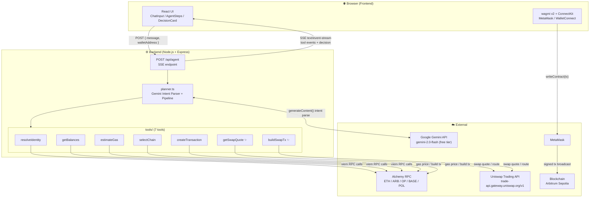
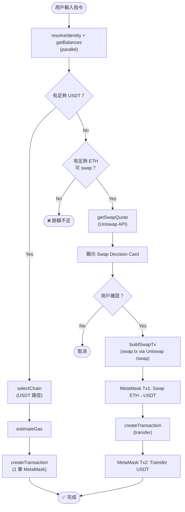
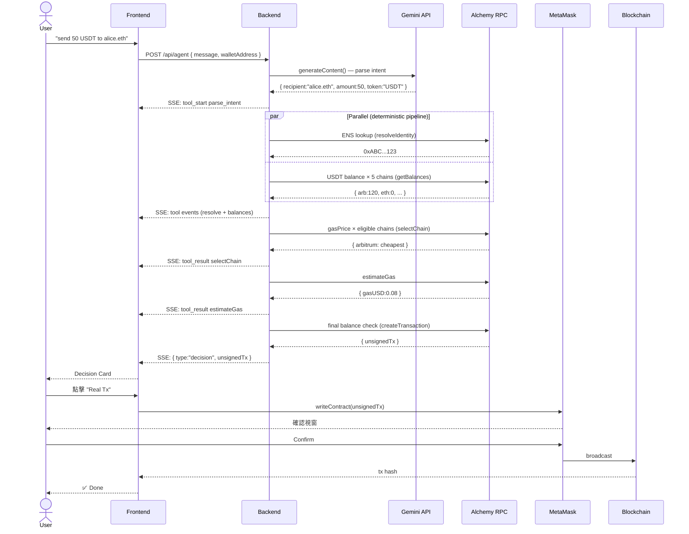
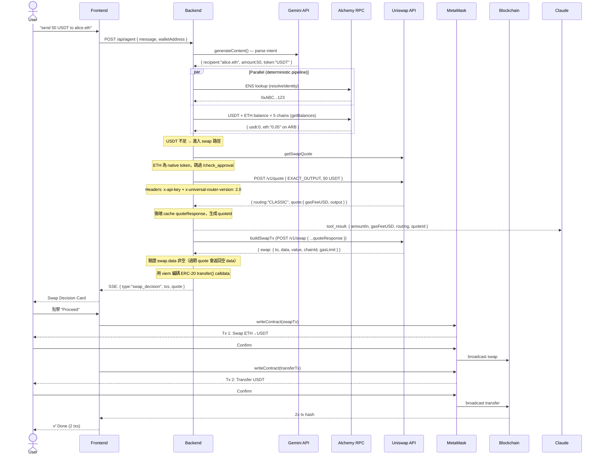
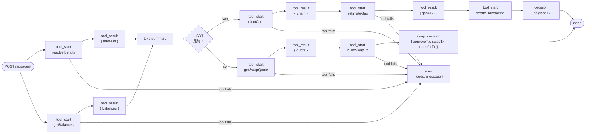

# Web3 AI Payment Agent — System Design

**Version:** 1.2
**Date:** 2026-04-26
**Project:** ETHGlobal OpenAgents Hackathon

---

## 1. High-Level Architecture



### 各層職責

| 層 | 技術 | 職責 |
|----|------|------|
| Frontend | React18 + Vite + TypeScript | UI 渲染、SSE 接收、使用者互動 |
| Wallet | wagmi v2 + ConnectKit | MetaMask 連接、簽名、廣播交易 |
| Backend | Node.js + Express | Anthropic API proxy、保護 API key、執行 tools |
| AI | Google Gemini 2.0 Flash (free tier) | 自然語言意圖解析（recipient / amount / token）|
| RPC | Alchemy | 多鏈 RPC、ENS 解析、餘額查詢、gas 估算 |
| Swap | Uniswap API | ETH → USDT 報價與路由 |

> **關鍵設計**：簽名不過後端。所有 tx 都是 unsigned，wagmi 直接送 MetaMask，後端不持有用戶私鑰。

---

## 2. 兩條執行路徑



---

## 3. API Flow — 直接轉帳路徑



---

## 4. API Flow — Uniswap Swap 路徑



---

## 5. SSE Event Flow



---

## 6. API Endpoint

```
POST /api/agent
Content-Type: application/json
→ Response: text/event-stream (SSE)
```

**Request**
```json
{
  "message": "send 50 USDT to alice.eth",
  "walletAddress": "0x..."
}
```

### SSE Event Types

| Event | 說明 |
|-------|------|
| `tool_start` | Pipeline 開始執行某個 tool |
| `tool_result` | Tool 執行完成 |
| `text` | 進度敘述文字（每個 tool 後一句話）|
| `decision` | 直接轉帳：最終未簽名 tx |
| `swap_decision` | Swap 路徑：approve + swap + transfer 三筆 tx |
| `error` | 致命錯誤（含 code + user-facing message）|
| `done` | 串流結束 |

### Error Codes

| Code | 觸發條件 |
|------|---------|
| `ENS_NOT_FOUND` | ENS 名稱無記錄 |
| `ENS_NO_ADDRESS` | ENS 存在但無 ETH 地址 |
| `INSUFFICIENT_BALANCE` | USDT 不足且無足夠 ETH 可 swap |
| `NO_ETH_FOR_GAS` | 有 USDT 但無 ETH for gas |
| `ALL_CHAINS_FAILED` | 所有 5 鏈 RPC 呼叫失敗 |
| `SWAP_QUOTE_FAILED` | Uniswap API 無法取得報價 |
| `LLM_TIMEOUT` | Gemini API 逾時 |

---

## 7. Tool 規格

### Tool 1: `resolveIdentity`
```typescript
Input:  { identifier: string }   // "alice.eth" | "0xABC..."
Output: { address: `0x${string}`, displayName: string,
          resolvedVia: "ens"|"direct", warning?: string }
```
- 已是 `0x` → 跳過 ENS
- ENS 過期 → 警告但繼續
- 失敗 → `ENS_NOT_FOUND` | `ENS_NO_ADDRESS`

---

### Tool 2: `getBalances`
```typescript
Input:  { address: `0x${string}`, chains: Chain[] }
Output: {
  balances: { [chain]: { usdt: string, eth: string, hasError: boolean } },
  totalUSDT: string,
  availableChains: string[]
}
```
- 5 chains 並行查詢
- USDT = **6 decimals**（非 18）
- 同時查 ETH 餘額（供 swap 路徑使用）
- 單鏈逾時 → `hasError: true`，繼續其他鏈

```typescript
const USDT_ADDRESSES = {
  ethereum: "0xdAC17F958D2ee523a2206206994597C13D831ec7",
  arbitrum: "0xFd086bC7CD5C481DCC9C85ebE478A1C0b69FCbb9",
  optimism: "0x94b008aA00579c1307B0EF2c499aD98a8ce58e58",
  base:     "0xfde4C96c8593536E31F229EA8f37b2ADa2699bb2",
  polygon:  "0xc2132D05D31c914a87C6611C10748AEb04B58e8F",
};
```

---

### Tool 3: `selectChain`
```typescript
Input:  { balances, amount: number, recipientAddress: string }
Output: { selectedChain: string, reason: string,
          gasEstimateUSD: number, eligibleChains: [...],
          userNativeBalance: { eth: string, sufficient: boolean } }
```
**選鏈邏輯：**
1. Filter: `usdt_balance >= amount AND !hasError`
2. Fetch gasPrice 各鏈（parallel）
3. `total_cost = gasPrice × 65,000 × eth_price_usd`
4. Sort by total_cost ASC
5. 確認最便宜的鏈有 ETH for gas，否則選次便宜

---

### Tool 4: `estimateGas`
```typescript
Input:  { chain, from, to, amount: bigint }
Output: { gasLimit: number, gasPrice: string, totalGasUSD: number,
          l1DataFeeUSD?: number, estimatedSeconds: number, warning?: string }
```
- 基礎 gas：65,000 × 1.2 buffer = 78,000
- L2 自動含 L1 data fee（viem `estimateGas` 處理）
- Gas 飆升 > 2x → 顯示 warning

---

### Tool 5: `createTransaction`
```typescript
Input:  { chain, to, amount, gasLimit }
Output: { unsignedTx: { to, data, gasLimit, chainId, value:"0x0" },
          finalBalanceCheck: { balance: string, sufficient: boolean } }
```
- 執行前做最終餘額確認（防 race condition）
- 編碼 ERC-20 `transfer()` calldata via viem
- 不簽名、不廣播

---

### Tool 6: `getSwapQuote` ✨ Uniswap
```typescript
Input:  { chain, walletAddress: `0x${string}`,
          amountOut: number }  // EXACT_OUTPUT: 我要 50 USDT，問需要多少 ETH（6 decimals）
Output: {
  amountIn: string,        // "0.025 ETH"
  gasFeeUSD: string,       // "0.01"（CLASSIC 路由；UniswapX 路由 gas 由 filler 代付）
  routing: string,         // "CLASSIC" | "DUTCH_V2" | "DUTCH_V3"
  gaslessSwap: boolean,    // true = UniswapX 路由，用戶不需付 swap gas
  quoteId: string,         // 後端生成（非 Uniswap 回傳），供 buildSwapTx 取回 cache
}
```

```typescript
// Uniswap Trading API — 取報價
// Step 1: ETH 為 native token，跳過 /check_approval
// Step 2: 取報價
POST https://trade-api.gateway.uniswap.org/v1/quote
Headers: {
  "x-api-key": process.env.UNISWAP_API_KEY,
  "x-universal-router-version": "2.0",   // 必填！
  "Content-Type": "application/json"
}
Body: {
  swapper: walletAddress,
  tokenIn: "0x0000000000000000000000000000000000000000",  // native ETH
  tokenOut: USDT_ADDRESSES[chain],
  tokenInChainId: String(chainId),    // 必須是字串，不是數字！
  tokenOutChainId: String(chainId),
  amount: amountInUnits,              // 6 decimals（USDT 為 EXACT_OUTPUT）
  type: "EXACT_OUTPUT",
  slippageTolerance: 0.5,
  routingPreference: "BEST_PRICE"
}
// 後端將完整 quoteResponse 存入 cache（TTL 30s），生成並回傳 quoteId
```

---

### Tool 7: `buildSwapTx` ✨ Uniswap
```typescript
Input:  { chain, quoteId, walletAddress, transferTo, transferAmount }
Output: {
  // ETH → USDT：native ETH 不需 approve，無 approveTx
  swapTx:      { to, data, value, gasLimit, chainId },  // Uniswap /swap 回傳
  transferTx:  { to, data, gasLimit, chainId },          // ERC-20 transfer calldata
  totalCostUSD: number
}
```
- 從 backend cache 取回 quoteResponse（用 quoteId；若逾時 > 30s 重新 /quote）
- 呼叫 Uniswap `/swap`，將 quoteResponse **spread** 進 body（不可 wrap 成 `{quote: ...}`）
- 驗證回傳 `swap.data` 非空、非 `"0x"`（過期 quote 回傳空 data 會導致 on-chain revert）
- transferTx → 同 createTransaction 的 ERC-20 calldata（via viem）
- 回傳 2 筆 unsigned tx，前端依序送 MetaMask（Tx1: Swap → Tx2: Transfer）

```typescript
// Uniswap Trading API — 取得未簽名 swap tx
POST https://trade-api.gateway.uniswap.org/v1/swap
Headers: {
  "x-api-key": process.env.UNISWAP_API_KEY,
  "x-universal-router-version": "2.0"
}
Body: { ...quoteResponse }  // spread 整個 quoteResponse，移除 null 欄位
// Response: { swap: { to, from, data, value, chainId, gasLimit } }
```

---

## 8. Functional Requirements

### FR-01 Wallet Connection
- 連接 MetaMask / WalletConnect via ConnectKit
- 自動取得 wallet address
- 偵測 `accountsChanged` / `chainChanged` / `disconnect` → 重置流程

### FR-02 Natural Language Input
- 接受任意自然語言（無固定格式）
- 支援中文、英文、中英混合
- Debounce 500ms；執行中鎖定輸入框
- 資訊不齊 → Claude 自動追問，用戶同語言回應

### FR-03 resolveIdentity
- ENS name → `0x` address（via Alchemy + ensjs）
- 已是 `0x` address → 跳過 ENS
- 錯誤：ENS 不存在 / 無地址 / 零地址 / 過期

### FR-04 getBalances
- 並行查詢 5 條鏈的 USDT 與 ETH 餘額
- USDT = 6 decimals（非 18）
- 單鏈 timeout → hasError，繼續其他鏈
- 全部失敗 → `ALL_CHAINS_FAILED`

### FR-05 selectChain
- Filter: USDT ≥ amount
- 確認有 ETH for gas
- 選最低 total gas cost 的鏈

### FR-06 estimateGas
- 65,000 gas + 20% buffer
- L2 自動含 L1 data fee
- Gas 飆升 > 2x → warning

### FR-07 createTransaction
- 最終餘額確認
- 編碼 ERC-20 `transfer()` calldata
- 回傳 unsigned tx

### FR-08 getSwapQuote（Uniswap）
- USDT 不足時觸發
- 呼叫 Uniswap API，使用 `EXACT_OUTPUT`（確保拿到足夠 USDT）
- 回傳 amountIn（需要多少 ETH）、price impact、route

### FR-09 buildSwapTx（Uniswap）
- 建構 3 筆 unsigned tx：approve + swap + transfer
- 回傳給前端，由 wagmi 依序送 MetaMask

### FR-10 Human-in-the-Loop
- 直接轉帳：1 筆 MetaMask 確認
- Swap 路徑：3 筆 MetaMask 確認（approve → swap → transfer）
- Demo Mode：不廣播
- Real Mode：廣播至測試網

---

## 9. Non-Functional Requirements

### Performance

| 指標 | 目標 |
|------|------|
| ENS 解析 | < 2s |
| 多鏈餘額查詢（5 chains 並行）| < 3s |
| 直接轉帳 Agent 流程 | < 8s |
| Swap 路徑 Agent 流程 | < 10s |
| 首個 SSE 事件出現 | < 500ms |
| Frontend bundle | < 500KB |

### Security

| 需求 | 實作 |
|------|------|
| API key 保護 | `GEMINI_API_KEY`、`ALCHEMY_API_KEY`、`UNISWAP_API_KEY` 只存後端 `.env` |
| 不持有私鑰 | 後端只建 unsigned tx，簽名全在 MetaMask |
| Human-in-the-loop | 每筆 tx 都需要 MetaMask 確認 |
| 輸入驗證 | 前端：amount > 0、有效 ENS/0x 格式 |
| Rate limiting | 500ms debounce + 一次一個 request |

### Reliability

| 需求 | 實作 |
|------|------|
| 部分鏈失敗容錯 | `getBalances` 繼續其他鏈 |
| RPC 重試 | 429 → exponential backoff，max 2 次 |
| Gas 保護 | 20% buffer |
| Race condition | `createTransaction` 前最終餘額確認 |
| Swap 失敗 | Uniswap API 失敗 → `SWAP_QUOTE_FAILED`，建議用戶先取得 USDT |
| Quote 過期 | `buildSwapTx` 前驗證 `swap.data` 非空，過期則重新呼叫 `/quote` |

---

## 10. 實作時程

```
剩餘 5 天（前後端並行）

API Keys 狀態
  Alchemy      ✅ 已取得
  Uniswap      ✅ 已取得
  Gemini       ── 需至 aistudio.google.com/app/apikey 申請（免費，不需信用卡）

─────────────────────────────────────────────────────────────

Day 1 — 環境建置 + 前端骨架 + Backend Web3 基礎
  Backend
  ├─ viem 多鏈 provider（Alchemy）
  ├─ resolveIdentity（ENS + edge cases）
  └─ getBalances（5 chains 並行，含 ETH 餘額）
  Frontend
  ├─ React + Vite + wagmi v2 + ConnectKit 初始化
  ├─ WalletConnect.tsx（MetaMask 連接）
  └─ ChatInput.tsx（輸入框 + debounce）

  🎯 Day 1 成果
     瀏覽器可以看到：錢包連接按鈕、輸入框
     Terminal 可以看到：ENS 解析結果、5 鏈 USDT + ETH 餘額查詢 log

─────────────────────────────────────────────────────────────

Day 2 — Backend 決策工具 + 前端 SSE hook
  Backend
  ├─ selectChain（有餘額 ∩ Gas 最低 ∩ 有 ETH）
  ├─ estimateGas（含 L1/L2 費用）
  └─ createTransaction（final check + calldata）
  Frontend
  ├─ useAgentStream.ts（SSE hook，用 mock event 先測）
  └─ AgentSteps.tsx（步驟可視化，streaming 動畫效果）

  🎯 Day 2 成果
     瀏覽器可以看到：Agent Steps 一條一條跑出來（mock 假資料）
     Terminal 可以看到：selectChain 選出最低 gas 的鏈、estimateGas 數字

─────────────────────────────────────────────────────────────

Day 3 — AI 整合（直接轉帳路徑）+ 前後端首次串接  ← MVP 里程碑
  Backend
  ├─ Express server + /api/agent SSE endpoint
  ├─ planner.ts（Gemini intent parser + deterministic pipeline）
  └─ systemPrompt.ts
  Frontend + 串接
  ├─ DecisionCard.tsx（直接轉帳決策卡片）
  └─ 串接真實後端 SSE（取代 mock）

  🎯 Day 3 成果（最重要的一天）
     瀏覽器可以看到：
       輸入 "send 50 USDT to vitalik.eth"
       → Agent Steps 逐步出現（resolveIdentity / getBalances / selectChain...）
       → 出現 Decision Card（地址 / 鏈 / Gas 費用）
       → Demo Mode 按鈕可點（不廣播）
       → Real Mode 跳出 MetaMask 確認視窗

─────────────────────────────────────────────────────────────

Day 4 — Uniswap 整合 ✨ + Swap 前端
  Backend
  ├─ getSwapQuote（Trading API /v1/quote，EXACT_OUTPUT，含 quoteResponse cache）
  ├─ buildSwapTx（/v1/swap spread quoteResponse，回傳 swapTx + transferTx）
  └─ selectChain 補充：USDT 不足時觸發 swap 路徑判斷
  Frontend
  ├─ SwapDecisionCard.tsx（顯示 amountIn / gasFeeUSD / routing）
  └─ useTransaction.ts（wagmi 多筆依序送 MetaMask）

  🎯 Day 4 成果
     瀏覽器可以看到：
       輸入 "send 50 USDT to alice.eth"（錢包無 USDT 但有 ETH）
       → Agent Steps 顯示 "No USDT found. Checking ETH..."
       → 出現 Swap Decision Card（0.025 ETH → 50 USDT / gasFeeUSD / routing）
       → 點擊 Proceed → MetaMask Tx 1: Swap → MetaMask Tx 2: Transfer
       → 顯示 2 筆 tx hash

─────────────────────────────────────────────────────────────

Day 5 — 測試 + Polish + Demo 準備
  測試
  ├─ MetaMask 單筆 sign（直接轉帳路徑）
  ├─ MetaMask 雙筆 sign（swap → transfer 路徑）
  ├─ Arbitrum Sepolia 測試網端對端驗證
  └─ 錯誤場景（餘額不足、ENS 不存在、MetaMask 拒絕、quote 過期重試）
  收尾
  ├─ UI 美化（進度標示 1/2、loading states、error messages）
  ├─ FEEDBACK.md（Uniswap 使用體驗，必填才有獎項資格）
  ├─ Demo 腳本（直接轉帳 + swap 各一個場景）
  └─ README + demo video

  🎯 Day 5 成果
     完整可 demo 的應用，兩條路徑均在測試網驗證成功
     FEEDBACK.md 完成 → Uniswap $5,000 獎項資格確認
```

### 風險管理

| 風險 | 緩解方式 |
|------|---------|
| ~~Uniswap API 申請太慢~~ | ~~Day 1 就申請，Day 4 實作時已有 key~~ ✅ Key 已取得 |
| Swap 整合複雜度超出預期 | Day 4 若卡住 → 降級為「顯示 swap 建議但不執行」|
| Uniswap quote 30s 過期 | `buildSwapTx` 驗證 `swap.data` 非空，過期自動重新 /quote |
| MetaMask 雙筆連續確認體驗差 | UI 清楚標示「1/2、2/2」進度 |
| 測試網 faucet 不夠 | 提前準備 Arbitrum Sepolia ETH |
| 5 天時程緊縮 | 前後端並行；Day 3 完成直接轉帳路徑即為 MVP |

---

## 11. Directory Structure

```
web3-ai-agent/
├── frontend/
│   └── src/
│       ├── components/
│       │   ├── ChatInput.tsx         ← NL 輸入框
│       │   ├── AgentSteps.tsx        ← SSE 步驟可視化
│       │   ├── DecisionCard.tsx      ← 直接轉帳決策卡片
│       │   ├── SwapDecisionCard.tsx  ← Swap 路徑決策卡片 ✨
│       │   └── WalletConnect.tsx     ← ConnectKit 整合
│       ├── hooks/
│       │   ├── useAgentStream.ts     ← SSE 連線管理
│       │   └── useTransaction.ts     ← wagmi writeContract（支援多筆）
│       └── web3/
│           ├── constants.ts          ← USDT addresses, chain configs
│           └── providers.ts          ← viem multi-chain clients
│
└── backend/
    └── src/
        ├── server.ts                 ← Express + SSE endpoint
        ├── agent/
        │   ├── planner.ts            ← Claude tool use 主邏輯
        │   └── systemPrompt.ts       ← System prompt（含 swap 路徑說明）
        ├── tools/
        │   ├── resolveIdentity.ts
        │   ├── getBalances.ts        ← 新增 ETH 餘額查詢
        │   ├── selectChain.ts        ← 新增 swap 路徑邏輯
        │   ├── estimateGas.ts
        │   ├── createTransaction.ts
        │   ├── getSwapQuote.ts       ← ✨ Uniswap API 報價
        │   └── buildSwapTx.ts        ← ✨ approve + swap + transfer tx
        └── web3/
            ├── providers.ts          ← viem Alchemy clients
            └── constants.ts          ← USDT addresses
```

